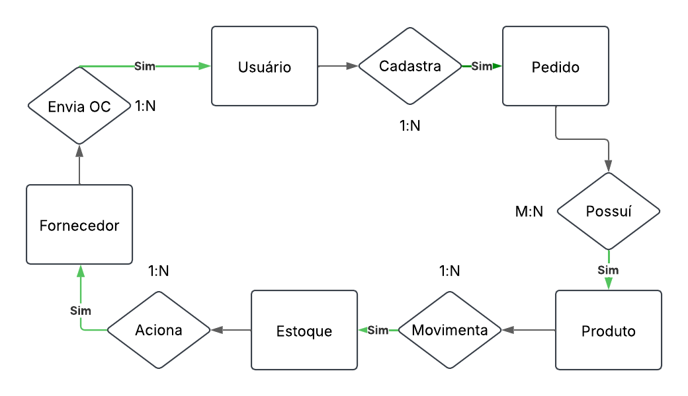

# Sistema de Gestão de Pedidos e Estoque

## Descrição
Este é um sistema web para gestão de pedidos, produtos, fornecedores e estoque, desenvolvido com HTML, CSS, JavaScript e Node.js, utilizando MySQL como banco de dados.

## Funcionalidades Principais
- Sistema de login e autenticação de usuários
- Gestão de usuários (cadastro, edição, ativação/desativação)
- Gestão de produtos (cadastro, consulta, edição)
- Gestão de fornecedores (cadastro, consulta, edição)
- Gestão de pedidos (criação, consulta, edição)
- Controle de estoque (movimentações de entrada e saída)

## Estrutura do Banco de Dados
O sistema utiliza as seguintes tabelas:
- **usuario**: Gerenciamento de usuários do sistema
- **produto**: Cadastro de produtos
- **fornecedor**: Cadastro de fornecedores
- **estoque**: Registro de movimentações de estoque
- **pedido**: Registro de pedidos

## Requisitos
- Node.js
- MySQL
- Navegador web moderno

## Como Instalar e Executar

### 1. Configuração do Banco de Dados
1. Acesse o MySQL
2. Execute o script `MySQL/CREATE.sql` para criar o banco de dados e as tabelas

### 2. Configuração do Servidor
1. Navegue até a pasta do projeto
2. Instale as dependências:
```bash
npm install express mysql2 cors
```
3. Configure as credenciais do banco de dados no arquivo `server/api.js`
4. Inicie o servidor:
```bash
node server/api.js
```

### 3. Acessando o Sistema
1. Abra o navegador
2. Acesse `http://localhost:3000`
3. Use as credenciais iniciais para login:
   - Usuário: adm
   - Senha: 123456

## Páginas Principais
- **index.html**: Página de login
- **tela_inicial.html**: Dashboard principal
- **produto_consultar.html**: Consulta de produtos
- **fornecedor_consultar.html**: Consulta de fornecedores
- **pedido_consultar.html**: Consulta de pedidos
- **estoque_consultar.html**: Consulta de movimentações de estoque

## Recursos Técnicos
- Frontend: HTML5, CSS3, JavaScript
- Backend: Node.js com Express
- Banco de Dados: MySQL
- API RESTful para comunicação cliente-servidor
- Interface responsiva com design moderno

## Segurança
- Sistema de autenticação por sessão
- Validação de dados no frontend e backend
- Proteção contra SQL Injection
- Controle de acesso baseado em status do usuário

---
## Banco de dados
Como já citado o SGBDs utilizado é MySQL, para a execução na comunicação com o banco de dados é necessário a execução do `DB.js`, para manter a conexão .




## Suporte
Para questões e suporte, por favor abra uma issue no repositório do projeto.